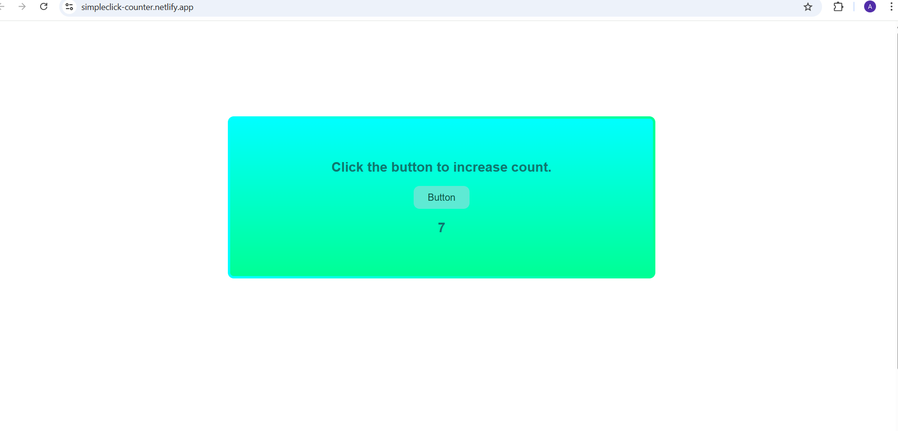

# 🔢 Button Click Counter

A simple and interactive **Button Click Counter** built using **HTML, CSS, and JavaScript**.  
This project helps beginners understand **DOM manipulation** and **event handling** in JavaScript.

---

## 🚀 Live Demo
👉 https://simpleclick-counter.netlify.app

---

## 🛠️ Technologies Used
- HTML5  
- CSS3  
- JavaScript (Vanilla JS)

---

## ✨ Features
- Click button to increase the counter
- Real-time update of count value
- Clean and simple UI
- Responsive design
- Beginner-friendly project

---

## 📂 Project Structure
Button-Click-Counter/
│── index.html
│── style.css
│── script.js

---

## 🧠 What I Learned
- DOM selection and manipulation
- JavaScript event listeners
- Styling using CSS
- Deploying a static website using **Netlify**
- Pushing projects to **GitHub**

---

## 📸 Preview

---

## 👤 Author
**Akshitha Gera**  
📧 Email: akshithaa.gera@gmail.com  
🔗 GitHub: https://github.com/AkshithaGera

---

## ⭐ Acknowledgement
This project is part of my learning journey in **Web Development**.
